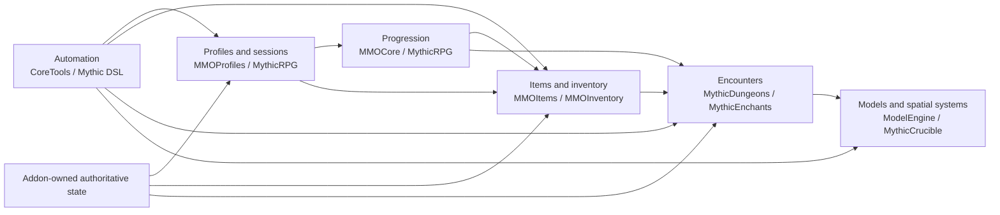

# Plugin Architecture And Logic

This document synthesizes the owned source review for the ten supplied plugins. Signatures come from bytecode; behavioral flows are `DERIVED_SOURCE`. Decompiled anomalies are risks to test, not claims about developer intent.

## System Map

The reusable lesson is ownership: profiles own character identity, progression systems own character growth, item systems own item definitions and effects, dungeon systems own run lifecycle, and ModelEngine owns visual projection. A new addon should own only its new state and connect these domains through narrow adapters.

## API Coverage

| Plugin | Plugin-owned types | Plugin-owned members | Bundled types retained | All members |
|---|---:|---:|---:|---:|
| CoreTools | 767 | 4,429 | 207 | 6,046 |
| MMOCore | 555 | 3,497 | 25 | 3,583 |
| MMOInventory | 67 | 397 | 0 | 397 |
| MMOItems | 656 | 4,644 | 0 | 4,644 |
| MMOProfiles | 80 | 642 | 73 | 1,228 |
| ModelEngine | 1,115 | 11,881 | 0 | 11,881 |
| MythicCrucible | 546 | 4,378 | 14 | 4,420 |
| MythicDungeons | 368 | 3,624 | 69 | 3,897 |
| MythicEnchants | 233 | 1,213 | 0 | 1,213 |
| MythicRPG | 560 | 4,557 | 10 | 4,578 |

## CoreTools 1.4.2

**Role.** Config-driven RPG automation: scripts, variables, stations, shops, auction, economy, wardrobe, private drops, profile data, and item-provider fan-in.

**Core flow.** A configured event wrapper produces a mutable `Context`. Registered condition and targeter factories inspect it; mechanics execute through `ScriptQueue`; variables, station callbacks, economy, and data storage make the result durable. The composition root eagerly builds feature managers, while `DelayedHooks` activates integrations after dependency discovery.

**Useful boundaries.** `Context`, `Condition`, `Mechanic`, entity/location targeters, `ScriptQueue`, `MultiSourceItemCreator.add`, variable/station/player-data events, and semi-public manager getters.

**Professional logic.** A shared context and stable string factories make an extensible DSL. Multi-provider item resolution hides Vanilla, MMOItems, Mythic, and other providers behind one pipeline. Optional features are isolated in delayed hooks.

**Risks.** The singleton and managers are not a separately versioned API. Suspicious UUID reference comparison and recursive discovery flows need runtime checks. Addon code should expose its own adapter rather than spread CoreTools internals.

**Evidence.** `ranet/coretools/CoreTools.java:78-240`; `hooks/DelayedHooks.java:33-190`; `scripts/casting/queue/ScriptQueue.java:20-106`; `util/items/creator/MultiSourceItemCreator.java:17-79`.

## MMOCore 1.13.1 Snapshot 59

**Role.** Classes, skills, attributes, professions, quests, parties, guilds, skill trees, resources, loot, waypoints, and experience.

**Core flow.** `onLoad` registers types and definitions; `onEnable` resolves data and integrations. Experience sources and events update `PlayerData`, which refreshes class/profession/skill-tree/resource projections and emits typed transitions.

**Useful boundaries.** `MMOCoreAPI`; `MMOCoreRegister`; `MMOLoadManager` and `MMOLoader`; `PlayerData`; `ExperienceObject`, curves, and scaling formulas; party/guild/quest module SPIs; class, XP, resource, skill, loot, and unlock events.

**Professional logic.** Stable IDs plus typed registries make configuration serializable. Two-phase loading prevents order-dependent references. External social systems sit behind provider modules. `PlayerData` is the progression aggregate rather than a bag of unrelated listeners.

**Risks.** Formula evaluation at a preview level appears inconsistent in one decompiled path. Static manager access and main-thread state mutation remain lifecycle-sensitive.

**Evidence.** `net/Indyuce/mmocore/MMOCore.java:89-293`; `api/MMOCoreAPI.java:25-68`; `api/player/PlayerData.java:94-1278`; `manager/MMOLoadManager.java:27-53`.

## MMOInventory 2.0 Snapshot 32

**Role.** Custom inventory layouts, equipment slots, restrictions, serialization, and interaction/equip/death behavior.

**Core flow.** `InventoryManager` loads layout and slot definitions. `RestrictionManager` builds eligibility rules. `InventoryProvider` retrieves compact or live player data. Changes emit inventory/equip events that MMOItems consumes through its equipment resolver.

**Useful boundaries.** Inventory and slot models, `InventoryManager`, `RestrictionManager`, `InventoryProvider`, `PlayerData`, `InventoryUpdateEvent`, `ItemEquipEvent`, `PlayerInteractCustomSlotsEvent`, and the legacy RPGInventory shim.

**Professional logic.** Storage representation is hidden behind a provider. Custom layout and restrictions are data-driven. Events let another system own derived equipment effects.

**Risks.** `MMOInventoryAPI` itself is empty. Removed slot IDs can break old serialized layouts unless migrated. Inventory slot restrictions and MMOItems use restrictions are distinct invariants.

**Evidence.** `net/Indyuce/inventory/MMOInventory.java:26-77`; `manager/InventoryManager.java:53-196`; `manager/RestrictionManager.java:28-60`; `player/CustomInventoryData.java:61-165`.

## MMOItems 6.10.1 Snapshot 59

**Role.** Item types, templates, stats, generation, crafting, upgrades, gems, sets, tiers, drops, custom blocks, and world generation.

**Core flow.** Type plus template configuration creates `MMOItemTemplate`. `MMOItemBuilder` applies randomized stat data, modifiers, tier, and level. `MMOItem` is materialized through `ItemStackBuilder`, which writes NBT/lore and emits events. Inventory resolver changes are buffered before abilities, effects, permissions, and set bonuses are recomputed.

**Useful boundaries.** `StatManager` and `ItemStat`; type/template managers; `MMOItemTemplate`, `MMOItemBuilder`, and `MMOItem`; crafting extension registries; `InventorySupplier`; build, lore, craft, equip, gem, reforge, repair, upgrade, durability, and weapon events.

**Professional logic.** Each stat owns parsing, validation, display, and application. Builders preserve a pre-materialization domain model. Build history and events make generation inspectable. Buffered equipment updates avoid recomputing after each slot mutation.

**Risks.** Some stat exceptions are caught while item building continues, which can produce partial items. Tier fallback behavior should be tested against the exact artifact. Registrations must occur before managers freeze.

**Evidence.** `net/Indyuce/mmoitems/MMOItems.java:84-400`; `api/item/template/MMOItemTemplate.java:94-214`; `api/item/build/MMOItemBuilder.java:41-171`; `inventory/InventoryResolver.java:52-300`.

## MMOProfiles 1.2 Snapshot 29

**Role.** Multiple characters, vanilla state snapshots, plugin data modules, placeholders, and Bukkit/Velocity profile handoff.

**Core flow.** Bukkit Services exposes `ProfileProvider`. During select/unload, a pending event waits for every `ProfileDataModule`; the resulting `PlayerProfile` is validated/applied and post-events publish session readiness. Proxy requests coordinate profile ID and permissions across servers.

**Useful boundaries.** `ProfileProvider`, `ProfileDataModule`, `PlayerProfile`, `ProfileList`, placeholder processor, and create/remove/pending/select/autosave/unload/proxy events.

**Professional logic.** A service boundary reduces direct singleton coupling. The completion barrier lets multiple plugins restore their own state before a profile becomes active. Proxy transport is isolated from the Bukkit state machine.

**Risks.** The visible barrier has no timeout; always validate in `finally` and add diagnostics. Create-event cancellation appears unreliable in the decompiled snapshot. Key every addon record by stable account/profile identifiers.

**Evidence.** `fr/phoenixdevt/mmoprofiles/bukkit/MMOProfiles.java:47-177`; `fr/phoenixdevt/profiles/ProfileProvider.java:8-20`; `event/PendingProfileEvent.java:15-65`; `velocity/RequestHandler.java:30-125`.

## ModelEngine R4.1.0

**Role.** Entity models, bones, animation, VFX, hitboxes, mounts, screens, model generation, per-viewer rendering, culling, and LOD.

**Core flow.** Load installs `ModelEngineAPI`; enable builds scheduler, NMS/version adapters, registries, tickers, and compatibility modules. A `BaseEntity` becomes a `ModeledEntity`; a `ModelBlueprint` becomes an `ActiveModel`; bone behavior managers and renderers execute through phased ticks before version-specific packets are sent.

**Useful boundaries.** `ModelEngineAPI`; `ModeledEntity`; `ActiveModel`; model/bone/behavior interfaces; animation handlers and registries; phased tick tasks; behavior parser/model lifecycle events; metadata and `DataIO`.

**Professional logic.** Interface-first aggregates hide implementations. Registry-defined behavior schemas co-locate parser, manager, renderer, and validation. Renderer/animation factories are injected. A scheduler adapter and tick phases make update order explicit.

**Risks.** The static facade is lifecycle-sensitive. Cached behavior serialization can make late registration ineffective. NMS/network services and async model state are volatile boundaries.

**Evidence.** `com/ticxo/modelengine/core/ModelEngine.java:115-166,286-357`; `api/ModelEngineAPI.java:142-309`; `api/model/ModeledEntity.java:89-125`; `api/model/ActiveModel.java:44-190`.

## MythicCrucible 5.13.0-SNAPSHOT

**Role.** Mythic item traits, furniture, custom blocks, equippables, recipes, augments, sets, lore, world generation, and resource-pack build/deployment.

**Core flow.** Mythic pack items are wrapped as `CrucibleItem` under a recursion guard, then cross-references resolve in a second pass. Generation events apply traits and metadata. Reload unloads live feature registries before rebuilding and rescanning furniture. Pack generation composes generated/external assets before optional deployment.

**Useful boundaries.** `MythicCrucibleProvider`; the furniture API and placement result; craft, pack, and furniture events; semi-public feature managers; Mythic mechanics, conditions, targeters, and placeholders.

**Professional logic.** Two-pass resolution removes definition order dependence. Reload is treated as a transaction. Furniture placement returns an explicit failure enum. Resource-pack generation is a staged pipeline.

**Risks.** The supported explicit API is narrow. Provider state and manager access are reload-sensitive. Pack generation can be async, but Bukkit publication/world work must return to the owning scheduler.

**Evidence.** `io/lumine/mythiccrucible/MythicCrucible.java:67-296`; `api/MythicCrucibleAPI.java:8-30`; `items/ItemManager.java:84-282`; `generation/PackGenerationManager.java:185-555`.

## MythicDungeons 2.0.1-SNAPSHOT

**Role.** Classic, continuous, and procedural instances; room layout; queues; parties; difficulty; trigger graphs; rewards; spectators; moving blocks.

**Core flow.** A request validates player/party, cost, keys, cooldown, and join skill. `QueueData` coordinates readiness. `DungeonManager` creates an instance and container world. Triggers evaluate conditions and invoke functions over selected players. End/dispose restores state and unloads/deletes generated instance data.

**Useful boundaries.** `MythicDungeonsService`; dungeon/layout/function/trigger/condition registration; `DungeonFunction`, `DungeonTrigger`, `TriggerCondition`; instance listeners; dungeon, room, loot, player, trigger, and party events.

**Professional logic.** Trigger-condition-function graphs use composite, sequence, random, repeater, delayed, and conditional nodes. Instances maintain explicit lifecycle states. Layout strategies place weighted room connectors under bounds and depth limits.

**Risks.** Two service operations appear to return false after success. `IDungeonParty.hasPlayer` appears to compare UUID references. Several mutable manager views can corrupt state. Generated world deletion requires a dedicated, verified container path.

**Evidence.** `net/playavalon/mythicdungeons/MythicDungeons.java:205-1280`; `api/MythicDungeonsService.java:14-54`; `api/party/IDungeonParty.java:14-78`; `api/parents/elements/DungeonFunction.java:35-198`.

## MythicEnchants 5.13.1

**Role.** Custom/native enchant definitions, datapack output, custom offers/reagents, anvil/grindstone logic, trigger skills, and addon jars.

**Core flow.** Pack YAML loads rarity and enchant definitions, tag indexes, and native datapack records. Runtime listeners map 39 trigger families to equipped/item/mob definitions, fire cancellable Mench events, then dispatch configured Mythic skills. Custom enchanting computes offers from power, reagent, conditions, weight, and seed.

**Useful boundaries.** `MythicEnchantsAPI`; `EnchantmentDefinition` builder; registry/tag/ref APIs; `MythicEnchantsAddon` and `AddonContext`; apply/remove/prepare/skill-trigger events; mechanics, conditions, and targeters.

**Professional logic.** The builder centralizes validation and definition data. Tags enable declarative sets. Events split authorization from skill execution. Addons receive a constrained registration context and separate classloader.

**Risks.** A definition inserted late into the custom registry may still be absent from Bukkit's native registry and fail application. Addon lifecycle registrations may outlive a reload. Storage options and actual YAML stores need runtime confirmation.

**Evidence.** `com/stelliusstudio/mythicenchants/MythicEnchants.java:90-297`; `api/MythicEnchantsAPI.java:28-355`; `enchantment/EnchantmentDefinition.java:11-296`; `addon/AddonManager.java:20-145`.

## MythicRPG 0.0.1-SNAPSHOT

**Role.** Profiles, archetypes, talents, points, experience, spells, resources, casting UI, death rules, waystones, parties, friends, shared rewards, and economy.

**Core flow.** Config/pack data loads curves, sources, spells, talents, points, and archetypes. A profile wrapper selects an active subprofile; events mutate XP, levels, points, and spell state; casting consumes resources/cooldowns. JSON or SQL repository drivers persist data with versioned SQL migrations.

**Useful boundaries.** `MythicRPGProvider`; the broad `MythicRPGAPI`; bound `ProfileSession`; immutable DTO views; progression, spell, talent, reagent, profile, and archetype events; Mythic mechanics/conditions/targeters.

**Professional logic.** A small provider exposes immutable views and `Optional` results instead of mutable domain objects. Profile sessions bind player identity. Repository drivers and migrations isolate persistence.

**Risks.** The API is for loaded/live profiles, not guaranteed offline mutation. Two loaded events expose cancellation-like methods without Bukkit `Cancellable`. Snapshot artifacts demand exact consumer compilation.

**Evidence.** `io/lumine/mythicrpg/MythicRPG.java:48-233`; `api/MythicRPGAPI.java:23-207`; `api/ProfileSession.java:18-154`; `storage/StorageDriver.java:5-31`.

## Cross-Plugin Flows

### Profile-safe equipment

`MMOProfiles pending profile -> addon module loads stable item IDs -> MMOInventory populates layout -> MMOItems resolver buffers change -> one derived stat/set refresh -> module validates -> profile selected`

The profile module and addon repository own identity; inventory UI and item effects are projections. Every failure path completes the barrier and moves unknown items to recovery escrow.

### Generated item lifecycle

`Template/type -> builder/stat rolls -> materialized item -> craft/upgrade/enchant events -> equipment resolver -> provenance or economy audit`

Authoritative item identity should be an opaque stable ID. Lore and NBT can carry references but are not the audit ledger.

### Dungeon encounter projection

`Queue locks roster -> progression/item snapshot -> immutable run plan -> instance graph -> Mythic skills -> model/furniture projection -> reward escrow -> disposal/recovery`

Do not let visual bones, room GUI, or mutable manager collections become the source of truth.

### Reload-safe definition systems

`Unpublish old adapters -> unregister/deindex content -> parse and validate definitions -> second-pass references -> atomically publish registries -> emit loaded event`

When a vendor does not provide an atomic reload contract, prefer restart deployment over inventing partial hot-reload semantics.
